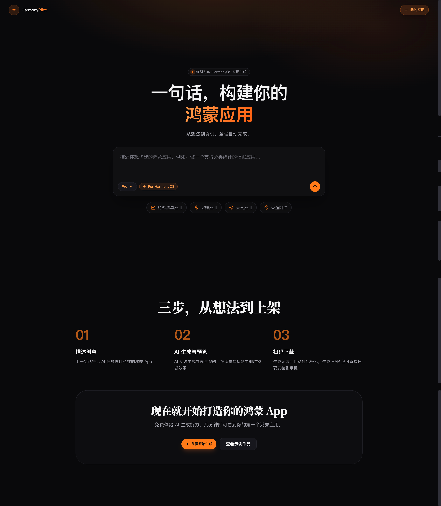
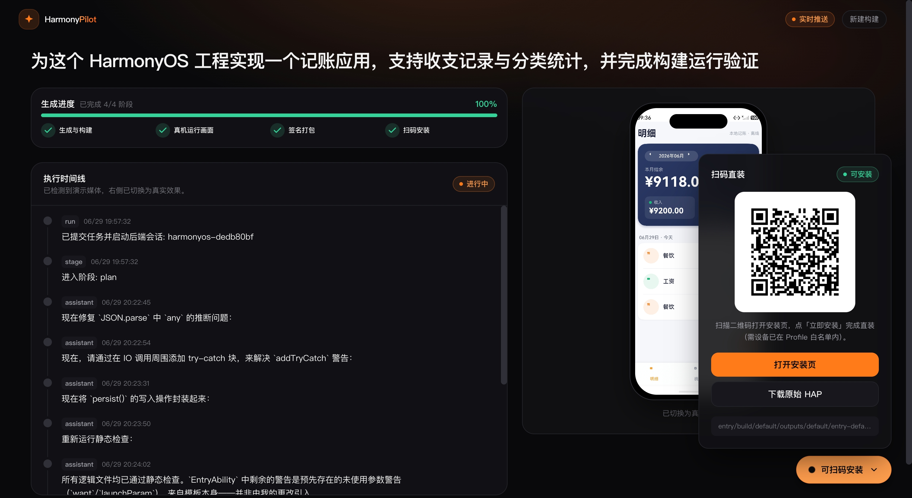

# Harmony Pilot Remote UI

一个独立于 `harmony-pilot` 主仓库的 Python Web 小项目，用来远程触发本地 `tmux-runner`，并在网页中展示简化后的执行轨迹、运行预览与扫码安装结果。

后端是标准库实现的纯 JSON API（不依赖 FastAPI、Flask 等第三方框架）；前端是位于 `web/` 的独立 **Vite + React + TypeScript + Tailwind CSS** 工程，通过 `/api` 与后端通信。前端单独调试方式见 [`web/README.md`](./web/README.md)。

## 界面预览

### 首页



### 执行演示



## 功能

- 首页一句话输入框，提交后进入详情页
- 详情页左侧实时显示生成进度与简化执行轨迹（SSE 推送，自动降级轮询），续跑、进度和安装包规则见 [`docs/FOLLOW_UP_AND_INSTALL.md`](./docs/FOLLOW_UP_AND_INSTALL.md)，右侧设备预览检测到 GIF/视频后自动切换
- 0→1 首版本在 QA、unsigned HAP 和预览就绪后自动签名并生成二维码；后续调整只刷新代码、HAP 和预览，停在 80%，由用户点击「更新安装包」后才生成最新二维码
- 后端通过 `node /path/to/tmux-runner.cjs --cwd <workspace> --session <name> --variant <variant> "<prompt>"` 启动任务
- 状态来自目标工作目录下的 `.arkpilot/state/...`
- Expo 模式通过 `start-livetest.sh --project <workspace> --prompt-file <prompt.md> --session <name>` 启动，状态来自 `.expo-fast/state.json`；生成完成后停在 80% 并显示「等待打包实现」
- Expo 详情页会增量读取 `agent-trace.jsonl` 与各轮 `agent-repair-trace*.jsonl`，以折叠分组实时展示经过脱敏的 Claude Action 和 Assistant Message

## 运行

```bash
cd harmony-pilot-remote-ui
cp deploy/server.env.example deploy/server.env
cp deploy/profile-pool.example.json deploy/profile-pool.json
# 编辑 deploy/server.env：填入路径、签名密码、CLOUDFLARE_TUNNEL_TOKEN
# 可选：编辑 .env.local 覆盖本机单项配置
python3 scripts/preflight_verify.py
scripts/restart_dev.sh
```

`scripts/restart_dev.sh` 是推荐入口。它会清理旧进程，后台启动完整 Bitfun UI dev stack，并验证本机和公网 health：

- `127.0.0.1:8080`：React / Vite 新前端，对应 `https://bitfun-platform.com/`
- `127.0.0.1:8081`：Python JSON API 后端，提供 `/api/*`、HPack 安装页和 HAP 静态文件
- Cloudflare Tunnel：把 `bitfun-platform.com` 转发到本机 `127.0.0.1:8080`

旧的 `scripts/run_dev.sh` 只启动 Python 后端自带页面并让它占用 `8080`，会使公网首页回到 legacy UI；除非你明确要调试旧的 Python-only UI，否则不要用它启动 `bitfun-platform.com`。

### 前端界面

前端界面在 `web/` 目录单独维护。完整栈由 `scripts/restart_dev.sh` 启动，脚本内部会同时启动前端、后端和 Cloudflare Tunnel。

```bash
# 单独开发前端：起 Vite dev server（默认 5173，可用 VITE_API_TARGET 指向后端）
cd web && npm install && npm run dev

# 生产：构建静态产物，由后端 / Nginx 托管
cd web && npm run build                # 产物在 web/dist
```

只想单独调试前端界面（含脱离后端调 UI、连远端后端等场景），见 [`web/README.md`](./web/README.md)。

### 完整重启

改完代码或需要重启 Bitfun UI 服务时，用 `scripts/restart_dev.sh`。它只会停止自己管理的 `remote-ui-dev` tmux session，确认 `8080` 和 `8081` 端口已释放，再重新启动新 UI 栈并做 health 检查。若端口被其它进程占用，脚本会报错并列出占用者，不会主动杀掉其它生成中的 tmux 会话或无关进程。

```bash
cd /path/to/harmony-pilot-remote-ui

# 默认后台启动到 tmux session remote-ui-dev，并自动 curl health 验证
scripts/restart_dev.sh

# 前台启动，Ctrl+C 会停止 web + app + tunnel
scripts/restart_dev.sh --foreground

# 显式后台启动
scripts/restart_dev.sh --background

# 跳过额外预检
scripts/restart_dev.sh --skip-preflight
```

验证服务是否起来：

```bash
curl -fsS http://127.0.0.1:8080/api/health | head -c 120
curl -fsS http://127.0.0.1:8081/api/health | head -c 120
```

返回 `{"ok": true, ...}` 即正常。

### 本地开发启动与停止

已经单独配置 Cloudflare Tunnel，或者只需要本机访问时，使用
`scripts/restart_local.sh`。它不会启动项目自带的 Tunnel，前端和后端端口可独立覆盖：

```bash
# 默认使用 nohup 后台启动（前端 8180、后端 8181）
scripts/restart_local.sh

# 让已有 Tunnel 转发到 Vite 5173；自定义域名必须加入 Vite host 白名单
__VITE_ADDITIONAL_SERVER_ALLOWED_HOSTS=app.example.com \
FRONTEND_PORT=5173 BACKEND_PORT=8181 \
scripts/restart_local.sh

# 推荐的可观察模式：同一 session 内创建 backend、frontend 两个 window
__VITE_ADDITIONAL_SERVER_ALLOWED_HOSTS=app.example.com \
FRONTEND_PORT=5173 BACKEND_PORT=8181 \
scripts/restart_local.sh --tmux

tmux attach -t remote-ui-local

# 停止 nohup 或 tmux 模式启动的本地服务
FRONTEND_PORT=5173 BACKEND_PORT=8181 scripts/restart_local.sh --stop
```

tmux 模式默认使用 `remote-ui-local` session，可通过
`LOCAL_TMUX_SESSION` 修改。`--stop` 只停止这个受管 session 和
`data/pids/local-*.pid` 记录的进程树，不会停止 Expo/ArkPilot 生成任务，
也不会停止可能被其他任务共享的 `openbitfun-proxy` session。

`app.py` 启动时会自动读取 `deploy/server.env`（`.env.local` 仅作可选覆盖）。验证时至少需要配置：

- `HP_TMUX_RUNNER`: `harmony-pilot/scripts/tmux-runner.cjs` 的绝对路径
- `HP_TARGET_WORKSPACE`: HarmonyOS 工程根目录，例如 `~/devecoProject/demo`
- `HP_EXPO_FAST_ROOT`: Expo Harmony Fast Runtime 仓库绝对路径
- `HP_EXPO_FAST_APP_ROOT`: Expo 任务独立工作目录的父目录；每次构建会在这里创建新工程与对应的 Markdown Prompt
- `HP_EXPO_PUBLIC_SERVE_PORT`: Harmony Go 公网预览 Gateway 端口，默认 `3456`
- `HP_EXPO_PUBLIC_ORIGIN`: Harmony Go 中输入的公网前缀，当前默认 `https://devkit-go.yorha2b.cc`
- Profile 池模式：签名材料放 `deploy/signing/`，路径在 `deploy/profile-pool.json` 中配置；密码在 `deploy/server.env` 的 `HP_HPACK_*`
- 单 Profile 模式：在 `deploy/server.env` 中配置 `HP_HPACK_CERT` / `HP_HPACK_PROFILE` / `HP_HPACK_KEYSTORE` 等
- `CLOUDFLARE_TUNNEL_TOKEN`: Cloudflare Tunnel token（公网访问时需要）

### Expo Harmony Go 公网预览

后端会常驻一个只监听 loopback 的静态 Gateway，默认地址是
`http://127.0.0.1:3456`。Expo 任务完成并通过 Harmony Go 启动验证后，详情页会出现
“开启外网预览”按钮。开启操作只把该 Run 的 `dist/harmony-go` 注册到 Gateway，不会为每个
应用重复占用端口；关闭后对应的随机发布地址立即失效。

没有 Tunnel 时可先本地验证：

```bash
curl -fsS http://127.0.0.1:3456/health
```

配置 Cloudflare Tunnel 时，将 `https://devkit-go.yorha2b.cc` 对应的 origin 指向：

```text
http://127.0.0.1:3456
```

发布后的 Harmony Go 服务地址形如：

```text
https://devkit-go.yorha2b.cc/p/<随机发布令牌>
```

当前 Harmony Go 不会为 catalog 请求附加 Cloudflare Access 登录凭据，因此该静态路径需要
使用独立公开 hostname 或 Access Bypass；随机发布令牌负责避免可预测枚举。Gateway 只会读取
`HP_EXPO_FAST_APP_ROOT` 下经过导出校验的 `dist/harmony-go`，不会暴露 Prompt 或工程源码。

### 生成的鸿蒙工程目录

网页点击 Build 后，后端会把本次生成的 HarmonyOS 工程放到 `HP_TARGET_WORKSPACE` 下面。当前推荐配置是启用 Profile 池并设置 `HP_PROFILE_POOL_ISOLATE_WORKSPACE=1`，每个 run 都会独立生成一个目录：

```text
workspace/<run_id>/
```

这个目录就是可用 DevEco Studio 打开的鸿蒙工程根目录，里面会包含 `AppScope/`、`entry/`、`build-profile.json5`、`.arkpilot/state/` 等文件。每次运行的记录文件在：

```text
data/runs/<run_id>.json
```

其中 `workspace` 字段会记录该 run 对应的实际工程路径。

如果关闭 workspace 隔离，或者未启用 Profile 池，服务会复用：

```text
workspace/current/
```

这种模式下新 Build 会清空并覆盖上一次的目标工程目录，不适合同一时间并发生成多个应用。

## 公网访问

推荐正式方案：`Cloudflare Tunnel + Cloudflare Access`

- 固定域名，例如 `bitfun-platform.com`
- Tunnel 转发到本机 `127.0.0.1:8080`（React 前端），前端再把 `/api/*`、`/static/hpack/*`、`/hpack/*`、`/install/*` 代理到 `127.0.0.1:8081`
- Access 做邮箱登录和访问控制

安装 `cloudflared`：

```bash
brew install cloudflared
```

在 `deploy/server.env` 填入 `CLOUDFLARE_TUNNEL_TOKEN` 后，任选一种方式启动 Tunnel：

```bash
# 推荐：web + app + tunnel 一起启动
scripts/restart_dev.sh

# 或前台调试完整栈
scripts/restart_dev.sh --foreground
```

专用入口：

- `scripts/run_dev.sh`：旧 Python-only UI + tunnel。保留用于排查后端自带页面，不作为 `bitfun-platform.com` 推荐入口。
- `scripts/run_verify.sh`：只启动 Python 后端，用于 API / HPack / HDC 后端单独调试。
- `scripts/run_tunnel.sh`：只启动 Cloudflare Tunnel，用于手动拆分调试。

## 其他开发者首次配置

克隆仓库后按顺序完成（敏感文件均 gitignore，每人本机一份）：

| 步骤 | 操作 | 说明 |
|------|------|------|
| 1 | `pip install -r requirements.txt` | 需要 `qrcode`、`Pillow`、`imageio-ffmpeg`（二维码与视频生成） |
| 2 | 克隆并配置 `harmony-pilot` | `HP_TMUX_RUNNER` 指向其 `scripts/tmux-runner.cjs`；需支持 `ARKPILOT_BUNDLE_NAME` 环境变量 |
| 3 | `cp deploy/server.env.example deploy/server.env` | 填写 tmux-runner 路径、workspace、HPack 公网 URL、签名密码、Tunnel token |
| 4 | `cp deploy/profile-pool.example.json deploy/profile-pool.json` | 按本机 `.p7b` 文件名改 `slots[].profile` |
| 5 | 签名材料放入 `deploy/signing/` | 可用 `scripts/sync_deploy_signing_assets.sh` 同步 |
| 6 | 安装 DevEco 工具链 | macOS 默认路径见 `deploy/server.env.example`；Linux 需改 `HDC_PATH` / `HP_HVIGORW` / `HP_DEVECO_JAVA_HOME` |
| 7 | `python3 scripts/preflight_verify.py` | 全部 `[OK]` 后再启动 |
| 8 | Cloudflare | Tunnel 指向 `127.0.0.1:8080`；Access 对 `/static/hpack/*` 配置 **Bypass**（手机拉 manifest 不能走登录） |

**不要提交：** `deploy/server.env`、`deploy/profile-pool.json`、`deploy/signing/*`（除 `.gitkeep`）、`.env.local`

## HPack 扫码安装

项目支持通过 HPack release 打包、签名、发布安装页，并在详情页展示「扫码安装」二维码。0→1 首版本自动生成一次；后续每轮调整不会自动重签，只有用户点击详情页顶部的「更新安装包」才生成新安装页。通过 `deploy/server.env` 中 `HP_HPACK_ENABLED=1` 启用。

**推荐**：使用 Profile 池（`deploy/profile-pool.json` 存在时自动启用），签名材料放在仓库内 gitignore 目录：

```text
deploy/signing/
  release.cer
  release.p12
  app-aRelease.p7b
  app-bRelease.p7b
```

同步签名文件：

```bash
scripts/sync_deploy_signing_assets.sh \
  ~/path/to/release.cer \
  ~/path/to/release.p12 \
  ~/path/to/app-aRelease.p7b \
  ~/path/to/app-bRelease.p7b
```

**备选**：签名材料放在仓库外，例如：

```text
~/.harmony-pilot/hpack-sign/
  release.cer
  release.p7b
  release.p12
```

启动示例（单 Profile 模式，配置写在 deploy/server.env 或环境变量）：

```bash
HP_HPACK_ENABLED=1 \
HP_HPACK_BASE_URL=https://your-domain.com/static/hpack \
HP_HPACK_DEPLOY_DOMAIN=your-domain.com \
HP_HPACK_STATIC_ROOT=$(pwd)/static/hpack \
HP_HPACK_CERT=/Users/you/.harmony-pilot/hpack-sign/release.cer \
HP_HPACK_PROFILE=/Users/you/.harmony-pilot/hpack-sign/release.p7b \
HP_HPACK_KEYSTORE=/Users/you/.harmony-pilot/hpack-sign/release.p12 \
HP_HPACK_ALIAS=<key-alias> \
HP_HPACK_KEYSTORE_PASSWORD=<keystore-password> \
HP_HPACK_KEY_PASSWORD=<key-password> \
PORT=8081 python3 app.py
```

上面是后端单独调试方式。完整新 UI 栈仍然使用 `scripts/restart_dev.sh`，由 React 前端在 `8080` 代理 `/static/hpack/*` 到后端 `8081`。

首版本生成流程：

1. 后端检测到 `entry/build/default/outputs/default/entry-default-unsigned.hap`
2. 启动 `scripts/hpack_packager.py`
3. 等待 tmux run 状态文件 `.arkpilot/state/tmux-runs/<session>.json` 中的 `ui_qa` 完成：启用时必须为 `ui_qa.status: "complete"`；明确禁用（`enabled: false`）时可跳过
4. 重新执行 `assembleHap`，确保签名源 HAP 对应 UI QA 后的最终工作区代码
5. 执行 `hpack pr` 签名并生成安装包
6. 把 `hpack/build/<product>/` 发布到 `HP_HPACK_STATIC_ROOT/<remote_dir>/`
7. 详情页展示 `https://your-domain.com/static/hpack/<remote_dir>/index.html` 的安装二维码

后续调整流程：

1. 提交调整后，当前安装包立即标记为旧版，步骤条切换为 5 个离散阶段
2. Agent 只重新生成代码和 unsigned HAP，并刷新真机预览；不重复执行首版本 QA
3. 代码、HAP 和预览完成后进度停在 80%，首版本二维码仍可单独查看
4. 用户点击「更新安装包」后才重新编译、签名和发布
5. 最新二维码生成成功后进度到 100%，同时保留首版本二维码入口

`capture_status` / `capture-manifest.json` 表示 HDC 运行截图和预览视频采集，只服务于详情页预览；它不是 HPack 的 UI QA 放行条件。若 `ui_qa.status` 为 `failed`、`error` 或 `cancelled`，后端会阻止 HPack 签名并将分发状态标为失败。

注意：

- 当前跑通的是 `internaltesting` 指定设备分发，Profile 里没有的设备无法安装。
- `bundleName` 必须和 Profile 一致。
- `HP_HPACK_STATIC_ROOT` 对应的公网 URL 必须支持 HTTPS、`HEAD`、`Content-Length`，最好支持 `Range`。
- 证书、Profile、p12、密码和 tunnel token 不要提交到仓库。

## Media 接入约定

默认会按下面顺序寻找可展示媒体：

1. `data/artifacts/videos/<run_id>/` 下的 `.mp4/.webp/.gif/.png/.jpg`
2. 目标工作目录内最近生成的 `.mp4/.webp/.gif/.png/.jpg`

你后续可以让安装、截图、导出视频的流程把产物写到：

```text
data/artifacts/videos/<run_id>/demo.mp4
```

这样详情页右侧会自动展示。

## 纯 HDC 截图链路

项目里新增了一个独立脚本：

`scripts/hdc_runtime_capture.py`

详情页右侧模拟器使用独立的实时交互链路：WebRTC 可用时优先通过点对点 DataChannel 传输压缩 JPEG 和输入；建连失败时继续使用 REST 长轮询及归一化点击、滑动和滚轮操作。后端通过 HDC 控制设备，输入接口以 `Server-Timing` 暴露排队和 HDC 操作耗时。完整架构、限流参数、失败回退和测试口径见 [docs/LOCAL_INTERACTIVE_PREVIEW.md](docs/LOCAL_INTERACTIVE_PREVIEW.md)。

点击分段耗时记录在 `data/logs/live-preview-latency.jsonl`，日志达到大小上限后会保留一个轮转文件。WebRTC 候选类型、连接状态和点击到解码完成时延也写入该日志。


用途：

- 安装 `.hap`
- 用 `hdc shell aa start` 拉起应用
- 用 `hdc shell uitest uiInput click/swipe/keyEvent` 切 tab、滚动
- 用 `hdc shell snapshot_display` 截图
- 用 `ffmpeg` 生成 MP4

设计上吸收了 `qa_bundle` 的几个约定：

- 截图按 run 目录归档
- 截图文件名沿用 `<page>_<seq>.png` 风格
- 按“主 tab 首屏 + 滚动后续帧”的方式组织采集
- 优先根据工程 `Index.ets` 里的 `Tabs/TabBar` 定义识别 primary tabs
- 自动从工程本身推断 `bundleName` 和 `mainElement`
- 最终把 MP4 放到 `data/artifacts/videos/<run_id>/demo.mp4`

### 自动推断来源

脚本默认不需要额外 config 文件，会直接从工程里推断：

- `AppScope/app.json5` -> `bundleName`
- `entry/src/main/module.json5` -> `mainElement`
- `entry/src/main/ets/pages/Index.ets` -> `Tabs/TabBar/CenterTabBar`
- 各 page `.ets` 文件里的 `Scroll/List/Grid/WaterFlow` -> 是否需要滚动截图
- `.arkpilot/designs/design-manifest.json` 如果存在，也会参与 page 匹配

脚本会在运行时先抓一张 `bootstrap_0.png`，再根据真实屏幕尺寸自动生成：

- tab 点击坐标
- 滚动起止坐标
- 运行时 capture plan

生成的计划会写到：

`data/artifacts/videos/<run_id>/generated-capture-plan.json`

### 运行示例

```bash
cd harmony-pilot-remote-ui
python3 scripts/hdc_runtime_capture.py \
  --workspace ~/devecoProject/demo \
  --run-id demo-run-001
```

如果你想先只看自动生成的 plan，不连设备：

```bash
python3 scripts/hdc_runtime_capture.py \
  --workspace ~/devecoProject/demo \
  --plan-only \
  --run-id demo-run-001
```

### 输出产物

运行后会产生：

```text
data/artifacts/videos/<run_id>/
  capture-manifest.json
  generated-capture-plan.json
  demo.mp4
  screenshots/
    home_1.png
    home_2.png
    stats_1.png
    ...
```

### 环境约定

- `hdc` 优先从 `HDC_PATH` 读取
- 其次自动尝试：
  `/Applications/DevEco-Studio.app/Contents/sdk/default/openharmony/toolchains/hdc`
- 当前脚本不依赖 MCP，完全走 `hdc`
- `--config` 现在只是可选覆盖项，不再是必需前置文件
