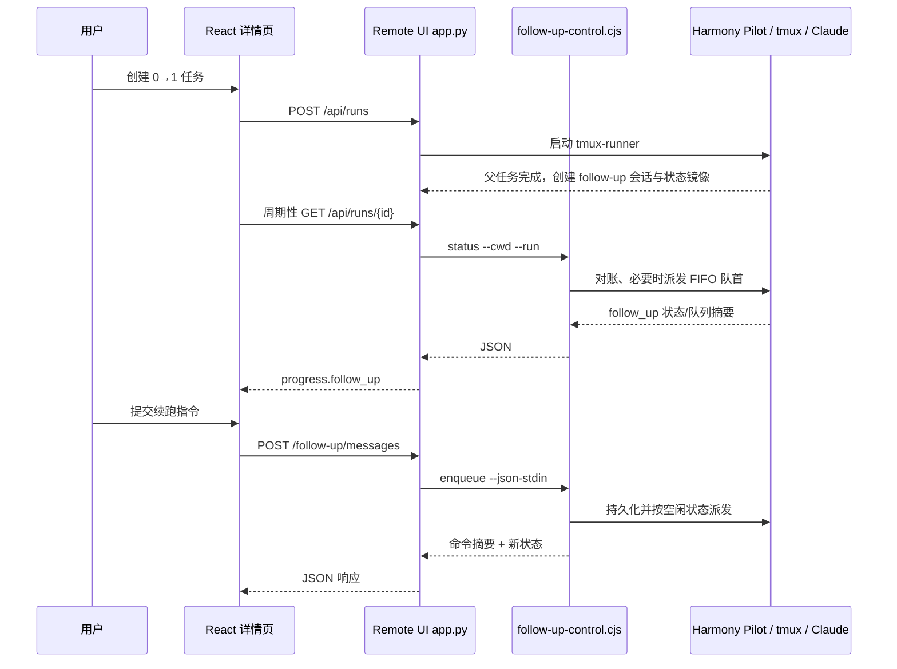

# 续跑与安装包最终实现说明

更新时间：2026-08-18

## 1. 目标与范围

本次实现包含两个相互独立、但在任务详情页协同展示的能力：

1. **首版本自动、后续按需生成安装包**：0→1 首版本在 QA、unsigned HAP 和预览就绪后自动签名并到 100%；后续调整不重复 QA，代码和预览就绪后停在 80%，只有用户点击后才重新编译、签名并生成最新二维码。
2. **生成后续跑（follow-up）**：Harmony Pilot 或 Expo Runner 的 0→1 工作流完成后，用户可以继续对同一工作区提出增量修改。Remote UI 只负责鉴权、展示与调用各 Runtime 自己的受控控制器。

本文描述当前已实现的前后端交互设计。Harmony Pilot 的控制契约来源于：
后端仓库的 `docs/follow-up-control-remote-ui-handoff.md`。

## 2. 系统边界与职责

| 层级 | 负责内容 | 不负责内容 |
| --- | --- | --- |
| 浏览器前端（React） | 展示任务/安装/续跑状态；提交调整；轮询更新；展示 FIFO 队列与中断状态 | 直接写 Runtime 状态文件；直接向 tmux/Agent 发按键；自行决定下一条消息何时派发 |
| Remote UI 服务端（`app.py`） | run 鉴权；将 HTTP 映射为 CLI 调用；向前端返回状态镜像；错误映射 | 保存或调度 follow-up 队列；解析/修改用户消息；管理 tmux 会话 |
| Harmony Pilot（`harmony-pilot`） | 创建 follow-up 会话；持久化命令；FIFO 调度；向 Claude 投递 prompt；中断确认；状态恢复 | Remote UI 的 HTTP 鉴权和页面渲染 |
| Expo Runner（`runner/`） | 复用首轮 Claude session；持久化 FIFO；执行增量修改、受控 check/build、外层复验和预览刷新 | Remote UI 的 HTTP 鉴权和页面渲染；向 Agent 暴露任意 shell |

**禁止事项**：Remote UI 不直接写 `.arkpilot/state`，不调用 `tmux send-keys`，不把用户输入拼入 shell 参数。

Runtime 分发由 `RunRecord.runtime` 决定：ArkPilot 调用 `follow-up-control.cjs`；Expo 调用 `runner/follow-up-control.sh`。两者复用同一组 HTTP API 与前端状态结构。

## 3. 整体交互流程



### 3.1 两个“完成”条件的区别

- **Harmony Pilot 工作流完成**：是创建真实 follow-up Agent/tmux 会话的前提。父 run 此后保持 `complete`，续跑不会把它改回 `active`。
- **统一 Agent 构建会话**：从任务创建开始展示；初始 Prompt 在右侧，首版本 Agent 输出在左侧。首版本二维码就绪前只禁用输入，不隐藏会话。
- **hpack 发布/签名成功**：不是创建 follow-up 会话的必要条件。ArkPilot 仍在首版本二维码就绪后开放输入；Expo 在首轮 Bundle 完成后即可开放，不让 HAP/签名拖慢修改反馈。
- **详情页进度 80%**：后续调整的方案、实现、unsigned HAP 和预览均已完成，等待用户继续调整或点击“更新安装包”。
- **详情页进度 100%**：签名包与二维码已生成，并且仍对应当前最新代码；开始新一轮调整后立即回到 80%。

因此，hpack 不影响统一会话窗口本身的展示，但首版本 hpack 失败时输入框保持禁用；首版本二维码成功后，后续安装包是否过期不再锁住续跑输入。

## 4. 前端设计

### 4.1 状态来源与轮询

主要文件：

- `web/src/pages/DetailPage.tsx`
- `web/src/hooks/useRunStream.ts`
- `web/src/lib/types.ts`
- `web/src/lib/api.ts`
- `web/src/components/detail/FollowUpPanel.tsx`

详情页使用 `useRunStream(runId)` 获取 `GET /api/runs/{id}` 的进度负载。

1. 详情页始终渲染统一会话窗口，并把 `run.prompt` 作为第一条右侧消息、`events` 作为左侧 Agent 消息。
2. ArkPilot 在首版本签名成功并持久化 `first_install_*` 后开放输入；Expo 在主 Bundle 完成后开放。两者都读取 `progress.follow_up` 与 `progress.follow_up_trace`。
3. 即使父 run 已是 `succeeded/failed`，只要已出现 unsigned HAP 或存在 `follow_up.run_name`，前端继续轮询，不会按父任务终态停止。
4. 轮询频率按状态调整：安装包生成中约 1 秒、follow-up `running` 约 1.5 秒、`interrupting` 750ms、`idle` 5 秒，其他情况使用普通轮询间隔。

### 4.2 面板行为

`FollowUpPanel` 只渲染后端公开的命令摘要：

- 会话状态：`starting`、`idle`、`running`、`interrupting`、`unavailable`。
- 当前命令：`active_command`。
- 排队消息：`queue`，按后端持久化 `sequence` 排列。
- 用户消息正文刻意不从状态接口返回，UI 仅显示“调整请求 #序号”。

为改善当前用户的可读性，前端会按 `client_request_id` 将本浏览器提交过的正文保存在 `sessionStorage`，并优先显示该正文；刷新同一标签页后仍可恢复。未由当前浏览器提交的历史命令仍只显示“调整请求 #序号”，不会从后端反查正文。

按钮规则：

| 后端状态 | 输入框 | 提交按钮 | 停止按钮 |
| --- | --- | --- | --- |
| `starting` / `unavailable` | 禁用 | 禁用 | 不显示 |
| `idle` | 可用 | “提交调整” | 不显示 |
| `running` | 可用 | “加入队列” | 当前活跃命令为 message 时显示 |
| `interrupting` | 禁用 | 禁用 | 禁用 |

前端不在真实模式维护本地 FIFO；接口响应会先更新临时快照，后续轮询用服务器镜像覆盖它。

### 4.3 续跑过程展示

统一会话窗口采用折中展示模式：默认展示业务化的当前阶段，并将“技术详情（最近 N 条）”默认折叠：

- 默认阶段包括“已接收调整，正在分析需求”“正在分析现有实现”“正在修改应用”“正在构建与验证”“本轮调整已完成”。阶段由运行状态和最近工具类别推导。
- 展开的技术详情才展示 `assistant` 文本摘要与 `tool` 名称，例如“Read”“Edit”“Bash”。
- 不展示工具入参、返回内容或 Agent 内部思考。
- 过程数据随主进度轮询刷新，不额外建立第二条控制器轮询链路。

### 4.4 前端请求接口

`web/src/lib/api.ts` 提供以下调用：

| 调用 | HTTP | 请求体 | 用途 |
| --- | --- | --- | --- |
| `getRun` | `GET /api/runs/{id}` | 无 | 主进度与嵌入的 follow-up 镜像 |
| `enqueueFollowUp` | `POST /api/runs/{id}/follow-up/messages` | `{ text, clientMessageId }` | 提交或加入 FIFO 队列 |
| `interruptFollowUp` | `POST /api/runs/{id}/follow-up/interrupt` | `{ clientActionId }` | 非破坏性中断当前消息 |
| `updateQueuedFollowUp` | `PATCH /api/runs/{id}/follow-up/messages/{commandId}` | `{ text }` | 编辑尚未派发的消息 |
| `removeQueuedFollowUp` | `DELETE /api/runs/{id}/follow-up/messages/{commandId}` | 无 | 删除尚未派发的消息 |

`clientMessageId` / `clientActionId` 使用浏览器端 `crypto.randomUUID()` 生成。若网络重试需要严格去重，调用方必须复用同一个 ID；当前正常点击流程每次生成新 ID。

## 5. Remote UI 服务端设计

### 5.1 CLI 适配层

主要实现位于 `app.py`：

- `follow_up_cli_path(record)`：ArkPilot 从 `TMUX_RUNNER_PATH` 同级目录定位 `follow-up-control.cjs`；Expo 从 `HP_EXPO_FAST_ROOT` 定位 `follow-up-control.sh`。
- `call_follow_up_control(record, action, body)`：按 Runtime 直接执行控制器，不经 shell。
- `load_follow_up_status(...)`：为主进度接口加载状态镜像。

实际进程形式为：

```text
node <harmony-pilot>/scripts/follow-up-control.cjs <status|enqueue|interrupt|update|remove>
  --cwd <record.workspace>
  --run <record.session_name>
  [--json-stdin]

<runner>/follow-up-control.sh <status|enqueue|interrupt|update|remove>
  --cwd <record.workspace>
  --run <record.session_name>
  [--json-stdin]
```

当有请求体时，`app.py` 将 `JSON.stringify` 等价的 JSON 通过进程标准输入传入；用户的 `text` 永不出现在 argv 或 shell 字符串中。进程超时为 15 秒，高于控制器默认的 10 秒中断确认等待。

### 5.2 HTTP 路由与映射

所有路由先经 `load_accessible_run` 完成已有的访问控制，再将 `run_id` 映射为保存于 `RunRecord` 中的：

- `workspace` → CLI 的 `--cwd`
- `session_name` → CLI 的 `--run`

| Remote UI 路由 | CLI action | 输入 | 响应 |
| --- | --- | --- | --- |
| `GET /api/runs/{id}/follow-up` | `status` | 无 | 原样返回 `{ ok, follow_up }` |
| `POST /api/runs/{id}/follow-up/messages` | `enqueue` | `{ text, clientMessageId }` | `{ ok, accepted, duplicate, command, follow_up }` |
| `POST /api/runs/{id}/follow-up/interrupt` | `interrupt` | `{ clientActionId }` | `{ ok, accepted, duplicate, command, follow_up }` |
| `PATCH /api/runs/{id}/follow-up/messages/{commandId}` | `update` | `{ text }` | 更新 queued command 与状态镜像 |
| `DELETE /api/runs/{id}/follow-up/messages/{commandId}` | `remove` | 无 | 删除 queued command 与状态镜像 |
| `GET /api/runs/{id}` | `status`（ArkPilot 在镜像存在时；Expo 始终可恢复） | 无 | 返回 `progress.follow_up` 状态及 `progress.follow_up_trace` 过程摘要 |

`GET /api/runs/{id}` 中的 `status` 不只是读操作：Harmony Pilot 会借此对账 prompt 收据/idle 标记，必要时派发 FIFO 队首。因此前端同一 run 只保留一个轮询链路，避免无意义的并发 `status` 调用。

### 5.3 错误映射

控制器稳定错误由 CLI 以非零退出码和 JSON 返回。Remote UI 映射如下：

| 控制器 code | HTTP 状态 |
| --- | --- |
| `run_not_found`、`follow_up_not_found`、`invalid_follow_up_session` | 404 |
| `control_busy` | 409 |
| `invalid_run_name`、`invalid_client_request_id`、`empty_message`、`message_too_large` | 400 |
| `control_unavailable`、`follow_up_unavailable` | 503 |
| 其他内部错误 | 500 |

对于主进度接口，状态读取失败会降级为 `follow_up.status = unavailable` 与 `last_error`，不影响普通任务进度继续显示。

### 5.4 Transcript 读取与脱敏

控制器的 `status` 响应包含可信的 `transcript_path`。该路径只在 Remote UI 服务端使用：

1. `app.py` 先调用一次 `status`，取得本轮状态和路径。
2. 服务端读取 JSONL，最多提取最近 60 条 assistant 文本事件。
3. 文本单条裁剪到 800 个字符；跳过 `thinking`、工具入参和工具结果。
4. 服务端将摘要放入顶层 `follow_up_trace`，再从所有浏览器响应的 `follow_up` 中移除 `transcript_path`。

因此浏览器不会获得本机绝对路径、原始 JSONL、内部思考或工具参数；同时不会因展示过程而额外触发一次 `status` 对账。

## 6. Harmony Pilot 控制器设计（后端仓库）

Harmony Pilot 在主工作流完成、报告/转录归档后创建专用 follow-up Agent 与 tmux window。它拥有以下数据：

```text
<workspace>/.arkpilot/state/tmux-runs/<run>.json
<workspace>/.arkpilot/state/sessions/<session-id>/follow-up-control/state.json
<workspace>/.arkpilot/state/sessions/<session-id>/follow-up-control/commands/<command-id>.json
```

- `tmux-runs` 是给 UI 识别会话存在与基本信息使用的镜像。
- `state.json` 和 `commands/*.json` 是控制器的真实持久化状态；Remote UI 不写入它们。
- 命令持久化字段包括 ID、请求 ID、type、sequence、状态、时间戳、错误及结果，不包含公开可读的消息正文。

### 6.1 状态机

会话状态：

```text
starting → idle ↔ running → interrupting → idle
                        │
                        └──────────────→ unavailable
```

消息命令：

```text
queued → sending → running → submitted → completed
                            └──────────→ interrupted
queued / sending ──────────────────────→ failed
```

中断命令：

```text
queued → interrupting → completed
                     └→ failed
```

控制器在 session `idle` 时只派发 FIFO 队首。中断会向 Claude 发送一次非破坏性 Escape；确认后把当前消息标记为 `interrupted`，并立即派发下一条。若确认超时，状态保持 `interrupting`，后续 `status` 轮询继续恢复。

### 6.2 Expo Runner 控制器

Expo 状态保存在生成工程内：

```text
<workspace>/.expo-fast/follow-up.json
<workspace>/.expo-fast/follow-ups/<command-id>.md
<workspace>/.expo-fast/revisions/NNN-follow-up/agent-trace.jsonl
```

控制器使用目录锁和原子 rename 保存状态，FIFO worker 每次只执行一个请求。用户正文写入独立 Markdown 文件，不进入 argv。每轮通过 `start-livetest.sh --follow-up-file` 恢复首轮 Claude session；Agent 仅额外获得绑定当前工程的 `check`/`build`，外层随后仍执行完整验证。Expo worker 在最终 gate 后立即释放队列，不等待设备租约；详情页轮询完成状态并发布最新 Bundle。中断向当前独立进程组发送 `SIGINT`，保留上一版已验证 Bundle，并把该轮 revision 标记为 `interrupted`。

## 7. 首版本与安装包设计

这部分与 follow-up 的状态机独立：

1. 0→1 首版本在 QA、unsigned HAP 和预览稳定后自动执行一次 hpack；成功后把安装 URL、商店 URL、manifest URL 与时间写回 `RunRecord.first_*` 字段。
2. 提交 follow-up 消息后，服务端持久化最近调整时间，并结合 active、queue、history 与 manifest 时间立即把当前安装包标记为过期；签名任务同时快照其对应的调整版本，防止签名期间新提交的调整被误判为已打包。
3. 后续调整不会自动调用 HPack，也不重复执行首版本 QA。ArkPilot 可维护 unsigned HAP 与预览；Expo 默认只重建并验证 Bundle，完成后由详情页轮询发布，不用设备等待阻塞 follow-up FIFO。
4. 最新预览就绪、主运行状态为 `completed` 且 follow-up 明确空闲后，顶部才显示可用的“更新安装包”按钮。
5. Expo 的 follow-up enqueue、HAP rebuild 与 HPack 启动共享 per-run 操作锁；任一构建/签名操作启动后，新的调整请求返回 `control_busy`，反向也不会在 active follow-up 期间启动 rebuild 或签名。
6. 用户点击 `POST /api/runs/{id}/package` 后，按钮在整个编译、签名和二维码生成期间不可重复点击；Expo 若尚无当前 revision 的 HAP，会先执行无模型的 `--rebuild --hap true --launch false`。
7. 生成成功后进度从 80% 变为 100%，右下角自动展开最新二维码；再次开始调整后进度退回 80%。
8. `GET /api/runs/{id}/install-qr?version=first` 专门返回首版本二维码。

### 7.1 续跑后的预览刷新

ArkPilot 续跑 Agent 重新构建并覆盖 unsigned HAP 后，Remote UI 会比较 HAP 修改时间与 `RunRecord.capture_hap_mtime`。Expo 的 follow-up 由 Runner 自己完成 Bundle 发布与桌面预览刷新，不经过这一 HAP 采集路径：

1. 发现更晚的 HAP 后，重置预览采集为等待状态并启动新的采集 monitor。
2. 采集命令优先使用配置 Python；配置路径不存在时回退到当前运行 Python。
3. 只有媒体文件修改时间不早于当前 HAP 时，才视为最新预览；旧截图/视频不会继续显示。
4. `DevicePreview` 在每次进度更新时使用带缓存破坏参数的媒体 URL，因此会加载新截图/视频。

首版本安装页可用与否不影响 follow-up 控制器的创建。页面输入门槛按 Runtime 区分：ArkPilot 等待首版本二维码，Expo 只等待首轮 Bundle 完成。

### 7.2 进度条规则

0→1 首版本展示 6 个阶段：

```text
方案设计 → 代码实现 → 构建产物 → 预览生成 → QA 验证 → 签名安装
```

首版本在 QA、unsigned HAP 和预览稳定后自动签名，二维码成功后为 100%。

首次提交 follow-up 消息后切换为 5 个阶段：

```text
方案设计 → 代码实现 → 构建产物 → 预览生成 → 签名安装
```

调整流程不重复 QA。每个阶段固定占 20%，只有完成才计入百分比，旋转态不预加半阶段：

- 方案设计完成：20%
- 代码实现完成：40%
- 最新 unsigned HAP 完成：60%
- 最新预览完成：80%
- 手动更新安装包并生成最新二维码：100%

签名阶段只有同时满足 `package_current`、`install_ready`、安装 URL 和二维码路径存在时才算完成。`distribution_status: ready` 不能单独把进度推到 100%，以免 run 记录残留的首版本状态造成误判。

## 8. 本地模拟与真实验证

### 8.1 本地模拟

用于在没有 hpack 发布域名、没有完整 follow-up tmux 会话时验证 UI：

| URL 参数 | 行为 |
| --- | --- |
| `?followup=demo` | 无条件模拟面板状态，不请求后端 |
| `?followup=hap-demo` | 仅在任务检测到 unsigned HAP 后启用模拟 |

模拟模式支持单条执行、FIFO 排队和停止后的下一条派发，但**不会**调用 CLI、不会修改应用代码、不会验证 Claude/tmux。

### 8.2 真实端到端验收

1. 从 Remote UI 新建任务，确保 Harmony Pilot 未使用 `--no-follow-up`。
2. 确认详情页立即显示初始 Prompt 和首版本 Agent 输出；等待首版本二维码自动生成后输入框开放，首版本进度为 100%。
3. 在 Network 中确认 `GET /api/runs/{id}` 响应包含 `follow_up.run_name`，面板状态最终为 `idle`。
4. 提交第一条消息，确认 `POST /follow-up/messages` 返回 200、`accepted: true`，面板变为 `running`。
5. 在运行中提交第二条，确认其在 `queue` 内且 sequence 递增。
6. 点击停止，确认接口返回后状态经历 `interrupting`，最终当前消息 `interrupted`，队首继续执行。
7. 等待调整完成，确认步骤条停在 80%，顶部显示“更新安装包”，且首版本二维码仍可查看。
8. 手动点击更新安装包，确认最新二维码生成后进度到 100%，刷新页面后状态和队列不丢失。

### 8.3 本地快速联调：跳过 QA

Remote UI 支持仅对**新建任务**生效的环境变量开关：

```text
HP_TMUX_SKIP_QA=1
```

启用后，`app.py` 在启动 tmux runner 时附加 `--no-ui-qa --no-core-flow-qa`。它不修改 Harmony Pilot 源码，也不会追溯改变已经进入 QA 的 run；用于快速验证“执行产出 HAP → 工作流完成 → follow-up 会话创建”的链路。常规环境不要设置该变量。

## 9. 当前限制与后续建议

- 队列支持编辑和删除；只有 `queued` 状态允许修改，已派发消息不可变。
- 消息正文不出现在公开队列状态中；过程展示仅提供裁剪后的 assistant/tool 摘要，不等同于完整可下载的对话归档。
- 建议补充 Remote UI API 自动化测试：权限、空消息、ID 幂等重试、`control_busy`、会话缺失与中断超时。
- 首版本自动签名、后续手动重签和 Expo follow-up/rebuild 均有进程内 per-run 互斥；跨服务进程部署时仍需确保同一 run 固定路由到同一 Remote UI 实例，或将互斥升级为外部锁。
